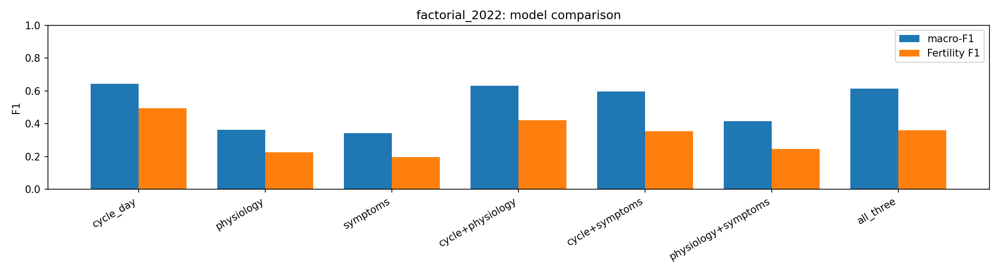

# Predicting menstrual cycle phase

A study on the mcPHASES dataset asking whether passive wearable signals or self-reported
symptoms predict hormonally-defined menstrual cycle phase.

## Key findings

- **Cycle timing dominates.** Days since menstruation alone predicts four-phase cycle phase
  at macro-F1 0.64 under leave-one-subject-out validation, the strongest of any model tested.
- **Passive physiology and symptoms are individually weak** (macro-F1 around 0.34) and, more
  importantly, add nothing on top of cycle timing: every combination scores at or below cycle
  day alone, so the extra channels only dilute it.
- **The physiological signal is real but small.** Physiology-only replicates across two
  independent collection periods (0.36 in 2022, 0.31 in 2024), so it is a genuine if faint
  phase signature, not a single-period artefact, and pooling more participants does not improve
  it, which points to a within-person rather than cross-person signal.
- **Product implication.** For phase classification on consumer-grade wearables, a simple cycle
  calendar outperforms passive sensor fusion. Where wearables could add value, resolving the
  cycle-to-cycle timing variability the calendar misses, likely needs per-user personalisation, more cycles per user, 
  richer sensors, or temporal models.

## Install

```
git clone <repo>
pip install -r requirements.txt
```

The mcPHASES dataset is not included, owing to its restricted licence. Download it from
PhysioNet (https://physionet.org/content/mcphases/) and extract into `data/`. The pipeline
reads from there; `data/` is gitignored and no participant-level data is committed.

## Research question

Which physiological correlates and composite measures predict menstrual cycle phase, given
hormonal measurements as ground truth?

## Data

The mcPHASES dataset (Lin et al., 2025) pairs continuous Fitbit physiological signals, skin
temperature, heart rate, heart-rate variability, respiratory rate, and sleep, with daily
at-home hormonal measurements from Mira urinalysis, for 42 participants across two roughly
three-month collection periods (2022 and 2024; 20 participants completed the second period).
Cycle-phase labels (Menstrual, Follicular, Fertility, Luteal) are derived from the hormonal
measurements by the dataset authors, giving quantitative ground truth rather than self-report.

## Methods

### Pipeline

The analysis is three stages, each with a single responsibility:

- `src/features.py` is the sole owner of raw-table extraction. It builds one row per
  participant-day, combining daily-aggregated physiological signals, nightly temperature,
  bleed flow, self-reported symptoms, and the phase label, and writes the base matrix to
  `data/` (gitignored).
- `src/model.py` reads only that matrix, performs all model-level transforms (per-participant
  standardisation, rolling features, days-since-bleed, symptom encoding), runs the experiments
  under leave-one-subject-out cross-validation, and writes aggregate metrics to `results/`.
- `src/results.py` reads only the aggregate result tables and renders the figures.

### Data cleaning and feature selection

Missingness in the dataset is structural rather than random, reflecting the two collection
intervals and partial device deployment. Several signals were therefore excluded from the
primary feature space: beat-level heart-rate aggregates (available only for participant IDs at
or below 24, so resting heart rate was used instead, being both cross-cohort and the more
established cycle-tracking signal); continuous glucose (Dexcom, available for only 18 of 40
participants); and sleep composition and duration sub-scores. Quality-metadata columns
(recording coverage, signal-to-noise ratios, measurement-error estimates) were not used as
predictive features, since they reflect data quality rather than physiological state.

An early version of the matrix was inflated by a row-multiplication bug: tables that are
nominally daily in fact carry multiple rows per participant-day (timestamped sleep sessions,
repeated VO2-max estimates), and merging them without aggregation multiplied rows and scrambled
the feature-to-label alignment. Collapsing these tables to a daily mean before merging, and
adding a uniqueness assertion, corrected this. Both collection periods are retained, since the
wearable signals are well populated across both; however, bleed flow and self-reported symptoms
were logged only in 2022, which constrains the experiment design below.

### Feature engineering

The modelling used a compact, physiologically-motivated set rather than an exhaustive
cross-product, to avoid overfitting under
leave-one-subject-out. Three channels were defined:

- **Cycle timing**: days since the most recent bleeding day (flow greater than spotting),
  derived from self-reported flow and available only for 2022. This is a self-report-derived
  feature, not a passive wearable one.
- **Physiology**: six signals, resting heart rate, sleep breathing rate, nightly temperature
  and its nightly variability, heart-rate variability (RMSSD), and sleep score, each
  standardised to the participant's own baseline (z-scored), with a 7-day rolling mean and
  standard deviation to capture the cycle trajectory and its variability.
- **Self-report**: twelve daily symptoms, encoded ordinally and represented as per-participant
  rolling standard deviations, following the variability signal identified by Specht et al.

### Classification and validation

A random forest with fixed hyperparameters (no tuning, for an unbiased estimate) was evaluated
with leave-one-subject-out cross-validation: all data from one participant is held out per fold
and the model trained on the rest. This prevents within-participant leakage and tests
generalisation to unseen individuals, the deployment-realistic setting. We report accuracy,
macro-averaged F1 (which weights all four phases equally and so is not dominated by the largest
class), and the Fertility-phase F1 separately, as it is the hardest and most product-relevant
phase.

Because cycle timing and symptoms exist only in 2022, the channel comparison is run as a
same-rows factorial on 2022 (every model on identical rows), while physiology-only, the only
channel present in 2024, is additionally evaluated across both periods to test replication.

## Results

### Channel factorial (2022; 2,251 participant-days, 39 participants)

| Model | macro-F1 | Fertility F1 | Accuracy |
| --- | --- | --- | --- |
| cycle day | **0.643** | **0.495** | 0.645 |
| physiology | 0.363 | 0.227 | 0.408 |
| symptoms | 0.343 | 0.196 | 0.354 |
| cycle + physiology | 0.632 | 0.420 | 0.653 |
| cycle + symptoms | 0.597 | 0.354 | 0.619 |
| physiology + symptoms | 0.416 | 0.246 | 0.442 |
| all three | 0.613 | 0.362 | 0.641 |

Cycle day alone is the best model on macro-F1, and adding physiology, symptoms, or both does
not improve it. The two non-timing channels are weak individually and combine only modestly
with each other (0.416), still far below cycle day.

### Physiology-only across periods

| Subset | macro-F1 | Fertility F1 | Accuracy | n |
| --- | --- | --- | --- | --- |
| both | 0.338 | 0.220 | 0.395 | 4,456 |
| 2022 | 0.360 | 0.255 | 0.423 | 2,660 |
| 2024 | 0.306 | 0.225 | 0.359 | 1,796 |




The physiological signal is weak but consistent across two independent periods, and pooling
both does not exceed 2022 alone.

### Benchmark

Specht et al. (2026), the only prior model on this dataset, reached macro-F1 0.662 using
self-reported symptoms with a gradient-boosted classifier and a hidden semi-Markov model on the
2022 cohort. Our symptoms-only random forest (0.343) sits well below this, consistent with the
simpler, non-temporal model class; a temporal model would likely lift all of the numbers above.

## Discussion

The dominant result is that cycle phase is predicted best by cycle timing alone, and that
neither passive wearable physiology nor self-reported symptoms add anything over it. This is
partly expected: phase is largely a function of position within the cycle, so days since
menstruation is close to the construct being predicted. The informative residual is the
cycle-to-cycle variability in ovulation timing that breaks a pure calendar, and that is exactly
where physiology could help; here it does not. Adding the physiology or symptom channels
increases the feature count and the variance under leave-one-subject-out without contributing
signal, so the combinations score at or below the one-feature calendar.

That said, the physiology does carry a genuine signal: it predicts phase above chance and
replicates across two independent periods. It is simply weak, and weaker cross-subject than
within-subject studies report. Studies such as Kilungeja et al. reach higher accuracy by
training on a participant's own earlier cycles; the leave-one-subject-out setting used here
tests cold-start generalisation to people the model has never seen, which is harder and more
representative of a new user.

For a product, the honest reading is that a cycle calendar is a strong, cheap baseline for
phase classification, and passive sensor fusion on consumer-grade wearables does not beat it in
this setting. The passive physiology model is fully zero-burden, unlike daily symptom logging,
so its modest standalone signal is still the more deployable of the two non-calendar channels.

## Limitations

- Consumer-grade Fitbit daily summaries are coarser than research-grade continuous sensors;
  richer signals (continuous HRV, electrodermal activity, dedicated temperature) may carry more.
- The model is a static per-day classifier and does not exploit the sequential structure of the
  cycle; temporal models (for example an HSMM, as in Specht et al.) may extract more.
- The cohort is small (around 40 participants), and bleed flow and symptoms exist only in 2022.
- Cycle phase is partly definitionally tied to cycle timing, so the cycle-day baseline is strong
  by construction.

## Future work

- Personalisation: more cycles per participant to learn individual baselines, since the signal
  appears within-person and within-subject studies perform better.
- Richer sensors and a dedicated temperature channel.
- Temporal models that use the sequence of days rather than each day independently.
- The binary fertile-window task, derivable by collapsing the four-phase predictions.

## Data access and handling

This project uses the mcPHASES dataset under the PhysioNet Restricted Health Data License. In
accordance with the licence, the raw data is not redistributed, and all derived participant-level
data (the processed feature matrix and the serialised model) is excluded from version control in
the gitignored `data/` directory. Only aggregate, non-identifying outputs, model performance
metrics, feature importances, and summary figures, are committed to `results/`. A guard in
`model.py` refuses to write any object carrying a participant identifier to `results/`, and
`results.py` reads only those aggregate tables, so the presentation layer cannot expose
participant-level information. All processing is performed locally.

## Repository structure

```
src/features.py   raw tables  -> data/feature_matrix.csv   (base matrix; gitignored)
src/model.py      matrix      -> results/*.csv             (aggregate metrics; + gitignored model)
src/results.py    results CSVs -> results/fig_*.png        (figures)
data/             gitignored: restricted data, derived matrix, serialised model
results/          committed: aggregate metrics and figures only
```

## References

Lin B, Li JY, Kalani K, Truong K, Mariakakis A. mcPHASES: A Dataset of Physiological, Hormonal,
and Self-Reported Events and Symptoms for Menstrual Health Tracking with Wearables (version
1.0.0). PhysioNet (2025). https://physionet.org/content/mcphases/  *(verify author list and the
companion Scientific Data 2026 article against the source before publishing)*

Specht B, EL-Khozondar M, Garbaya S, Schneider R, Khadraoui D, Tayeb Z. Self-Reported Symptoms
Enable Four-Phase Menstrual Cycle Classification with Hormonally Validated Labels. medRxiv (2026).
https://doi.org/10.64898/2026.03.31.26349766

Kilungeja G, Graham K, Liu X, Nasseri M. Machine learning-based menstrual phase identification
using wearable device data. npj Women's Health 3, 29 (2025).
https://doi.org/10.1038/s44294-025-00078-8

Goodale BM, Shilaih M, Falco L, Dammeier F, Hamvas G, Leeners B. Wearable Sensors Reveal
Menses-Driven Changes in Physiology and Enable Prediction of the Fertile Window: Observational
Study. JMIR 21(4), e13404 (2019). https://doi.org/10.2196/13404

Shi Y, Wang CC, Yang Y, Li Q, Chung PW, Wang Y. The diagnostic accuracy of wearable digital
technology in detecting fertility window and menstrual cycles: a systematic review and Bayesian
network meta-analysis. npj Digital Medicine 9, 139 (2026).
https://doi.org/10.1038/s41746-025-02320-8
